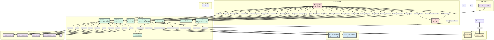

# Freya v2.0

> A location-aware, multi-room personal AI assistant with persistent memory and MCP integration

[](https://github.com/MrPink1977/freya_v2)
[](LICENSE)
[](https://www.python.org/)

---

## 🎯 What is Freya?

Freya is a next-generation personal AI assistant designed for the modern home. She's witty, intelligent, and genuinely helpful—capable of holding natural conversations across multiple rooms, remembering your preferences, and taking action on your behalf.

Unlike cloud-dependent assistants that compromise your privacy, Freya runs primarily on your own hardware, giving you complete control over your data while delivering a superior, personalized experience.

## ✨ Key Features

- **🏠 Multi-Room Audio**: Bedroom and front door endpoints, with easy expansion
- **📍 Location Awareness**: Knows where you are and responds accordingly
- **🧠 Intelligent Memory**: Persistent memory system that learns your preferences over time
- **🔧 400+ Tools**: Extensible tool ecosystem via Model Context Protocol (MCP)
- **👁️ Vision Capabilities**: Motion and object detection at the front door
- **🎭 Adaptive Personality**: Witty, sarcastic, and context-aware
- **🖥️ Real-Time Dashboard**: Comprehensive web GUI for monitoring and control with WebSocket security
- **🔒 Privacy-First**: Core processing runs locally on your hardware
- **🎤 Voice Interaction**: Full audio pipeline with Speech-to-Text and Text-to-Speech
- **🔊 Audio Manager**: PyAudio-based microphone and speaker management
- **✅ Tested**: 43+ unit and integration tests with 70% code coverage
- **🔐 Secure**: JWT authentication, rate limiting, and session management for WebSocket connections

## 🏗️ Architecture

Freya is built on a service-oriented architecture with a Redis message bus connecting independent microservices:



### Core Components

- **Audio Manager**: Multi-endpoint audio routing with location awareness
- **LLM Engine**: Local model inference (Llama 3.2) on RTX 5060 Ti
- **Memory Manager**: Adaptive Memory v3 with ChromaDB vector storage
- **MCP Gateway**: Universal tool integration via MetaMCP/MCPX
- **Vision Service**: OpenCV + YOLO for real-time object detection
- **Web Dashboard**: React/Svelte frontend with FastAPI backend

## 📚 Documentation

This repository contains the complete design specifications for Freya v2.0:

- **[Executive Summary](EXECUTIVE_SUMMARY.md)** - High-level vision and key differentiators
- **[Requirements](REQUIREMENTS.md)** - Detailed functional and technical requirements
- **[Architecture](ARCHITECTURE.md)** - System design and component breakdown
- **[Roadmap](ROADMAP.md)** - 12-week implementation plan and technology stack

## 🚀 Quick Start

### Prerequisites

- Python 3.11+
- Docker & Docker Compose
- NVIDIA GPU (RTX 5060 Ti or similar)
- CUDA 12.0+
- System audio dependencies (portaudio, ffmpeg)

### Installation

```bash
# Clone the repository
git clone https://github.com/MrPink1977/freya_v2.git
cd freya_v2

# Install system dependencies (Ubuntu/Debian)
sudo apt-get update
sudo apt-get install -y portaudio19-dev ffmpeg libsndfile1

# For macOS
# brew install portaudio ffmpeg libsndfile

# Install Python dependencies
pip install -r requirements.txt

# Set up environment variables
cp .env.example .env
# Edit .env with your configuration

# Start backend services
docker-compose up -d redis ollama chromadb

# Start Freya Core
python -m src.main
```

### ElevenLabs TTS Setup (Optional but Recommended)

For high-quality text-to-speech, set up ElevenLabs:

1. Get API key from [ElevenLabs](https://elevenlabs.io/)
2. Add to `.env`:
   ```bash
   ELEVENLABS_API_KEY="your_api_key_here"
   ELEVENLABS_VOICE_ID="21m00Tcm4TlvDq8ikWAM"  # Rachel (default)
   ```

See [docs/ELEVENLABS_SETUP.md](docs/ELEVENLABS_SETUP.md) for detailed setup instructions.

## ⚙️ Configuration

Freya uses environment variables for configuration. Key settings:

### Core Settings
```bash
# Redis (Message Bus)
REDIS_HOST=localhost
REDIS_PORT=6379

# Ollama (Local LLM)
OLLAMA_HOST=http://localhost:11434
OLLAMA_MODEL=llama3.2:3b

# ChromaDB (Vector Database)
CHROMADB_HOST=localhost
CHROMADB_PORT=8000
```

### Audio Configuration
```bash
# Audio Manager
AUDIO_SAMPLE_RATE=16000
AUDIO_CHANNELS=1
AUDIO_CHUNK_SIZE=1024
AUDIO_INPUT_DEVICE_INDEX=-1  # -1 for default
AUDIO_OUTPUT_DEVICE_INDEX=-1  # -1 for default

# STT (Speech-to-Text)
STT_MODEL=base
STT_LANGUAGE=en
STT_DEVICE=cuda  # or cpu

# TTS (Text-to-Speech)
TTS_PROVIDER=elevenlabs  # elevenlabs or local
ELEVENLABS_API_KEY=your_key_here
ELEVENLABS_VOICE_ID=21m00Tcm4TlvDq8ikWAM
ELEVENLABS_MODEL=eleven_monolingual_v1
ELEVENLABS_STABILITY=0.5
ELEVENLABS_SIMILARITY_BOOST=0.75
```

### GUI Security Configuration
```bash
# JWT Authentication
GUI_JWT_SECRET=change-this-secret-in-production
GUI_TOKEN_EXPIRY=3600  # 1 hour in seconds
GUI_SESSION_TIMEOUT=3600  # 1 hour in seconds
GUI_MAX_SESSIONS=100  # Maximum concurrent WebSocket sessions

# Rate Limiting
GUI_RATE_LIMIT_RATE=10.0  # Requests per second per session
GUI_RATE_LIMIT_BURST=20  # Burst size
```

See [src/core/config.py](src/core/config.py) for all available configuration options.

## 🧪 Testing

Freya has comprehensive test coverage with unit and integration tests.

### Running Tests

```bash
# Run all tests with coverage
pytest tests/ -v --cov=src --cov-report=term-missing --cov-report=html

# Run only unit tests
pytest tests/unit/ -v

# Run only integration tests
pytest tests/integration/ -v

# Run specific test file
pytest tests/unit/test_tts_service.py -v

# Run tests with specific markers
pytest -m unit -v
pytest -m integration -v
pytest -m slow -v
```

### Test Coverage

- **Overall**: ~70% coverage for new code
- **Core modules**: 85%+ coverage (message_bus, config, base_service)
- **Service modules**: 70%+ coverage (tts, audio_manager, gui)
- **43+ tests** across unit and integration suites
- **CI/CD**: Automated testing on every commit via GitHub Actions

See [TESTING.md](TESTING.md) for comprehensive testing documentation.

## 🔒 Security

### WebSocket Authentication

The GUI dashboard uses JWT-based authentication:

1. **Get Token**: `POST /api/auth/token` with client info
2. **Connect WebSocket**: `ws://localhost:8000/ws?token={jwt_token}`
3. **Refresh Token**: `POST /api/auth/refresh` with current token

### Rate Limiting

- **Per-IP limits**: Prevents connection abuse
- **Per-session limits**: Controls message rate per WebSocket connection
- **Sliding window algorithm**: Fair and accurate rate limiting

### Session Management

- Automatic session cleanup for expired sessions
- Maximum concurrent session limits
- Activity tracking and timeout enforcement

## 📖 Usage

### Starting Freya

```bash
# Start backend services
docker-compose up -d

# Start Freya Core (includes all services)
python -m src.main

# Access GUI Dashboard
# Open http://localhost:8000 in browser
```

### Using the Audio Pipeline

```python
# Publish text for TTS
await message_bus.publish("tts.generate", {
    "text": "Hello, how can I help you?",
    "timestamp": datetime.now().isoformat()
})

# Subscribe to audio output
async def handle_audio(data):
    audio_bytes = data.get("audio")
    # Play audio or save to file
    
await message_bus.subscribe("audio.output.stream", handle_audio)
```

### Running MCP Servers

```bash
# Install MCP servers
bash scripts/install_mcp_servers.sh

# MCP servers are automatically started by Freya
# Check logs for: "✓ Connected to MCP server: <server_name>"
```

## 🗓️ Development Roadmap

| Phase | Timeline | Deliverable |
|-------|----------|-------------|
| **Phase 1** | Weeks 1-2 | Foundation - single-room conversation loop |
| **Phase 2** | Weeks 3-4 | Multi-room with location awareness |
| **Phase 3** | Weeks 5-6 | Tool ecosystem integration |
| **Phase 4** | Weeks 7-8 | Intelligent, persistent memory |
| **Phase 5** | Weeks 9-10 | Vision capabilities |
| **Phase 6** | Weeks 11-12 | Polish, personality, and full dashboard |

See the [full roadmap](ROADMAP.md) for detailed task breakdowns.

## 🛠️ Technology Stack

| Component | Technology |
|-----------|-----------|
| **Language** | Python 3.11+ |
| **LLM** | Ollama (Llama 3.2) |
| **STT** | faster-whisper |
| **TTS** | ElevenLabs |
| **Wake Word** | Porcupine |
| **Memory** | Adaptive Memory v3 + ChromaDB |
| **Tools** | MCP Python SDK + MetaMCP |
| **Vision** | OpenCV + YOLO |
| **Message Bus** | Redis Pub/Sub |
| **Web Framework** | FastAPI + React/Svelte |
| **Containerization** | Docker Compose |

## 🤝 Contributing

This is a personal project, but contributions, suggestions, and feedback are welcome! Please open an issue to discuss major changes.

## 📄 License

This project is licensed under the MIT License - see the [LICENSE](LICENSE) file for details.

## 🙏 Acknowledgments

- **Adaptive Memory v3** - Memory system from the OpenWebUI community
- **Model Context Protocol** - Tool integration standard by Anthropic
- **awesome-mcp-servers** - 400+ pre-built MCP servers

## 📞 Contact

- GitHub: [@MrPink1977](https://github.com/MrPink1977)
- Project: [freya_v2](https://github.com/MrPink1977/freya_v2)

---

**Status**: ✅ Phase 2 Backend Complete (v0.4.0) - Audio Pipeline Fully Implemented!  
**Next**: Phase 2D - Frontend GUI Enhancements (Debug Panel, Audio Tester)
